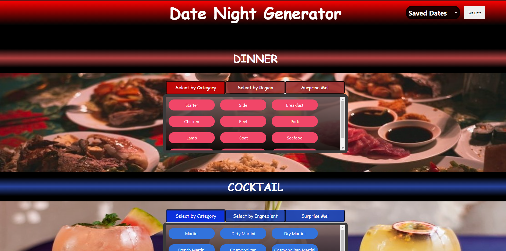

# Date Night Generator

## By Troy Grossi

## Objective:

Spice up any stay at home date night. Learn new recipes, discover new movies, and get out of your comfort zone. The dinner selections can generate recipes of all different regions of the planet. The cocktail selections can give familiar recommendations or give you a cocktail you have never heard of. The movei slections generate titles of all sorts of years and genres and offers a selection of top rated films. No planning involved. The date night generator will give you a night in tailored to your tastes and give you the recipes and step by step instrctuctions to have the perfect romantic night.

### Technologies:

- Plain HTML
- Plain CSS
- Plain JavaScript
- Bulma framework
- The MovieDB API
- The CocktailDB API
- The MealDB API
- Unsplash.com

### Features:

- 3 seperate APIs allows for thousands of different date nights
- Can locally save favorite date nights generated
- Scalability to any desktop screen

Live URL: https://troygrossi.github.io/Date-Night/

GitHub URL: https://github.com/troygrossi/Date-Night

ScreenShot: 
